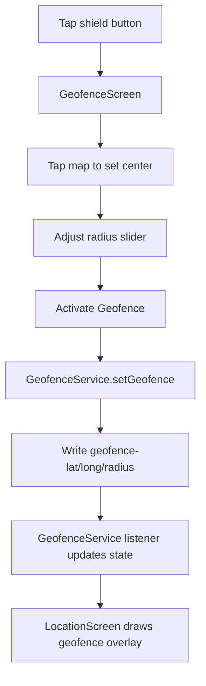
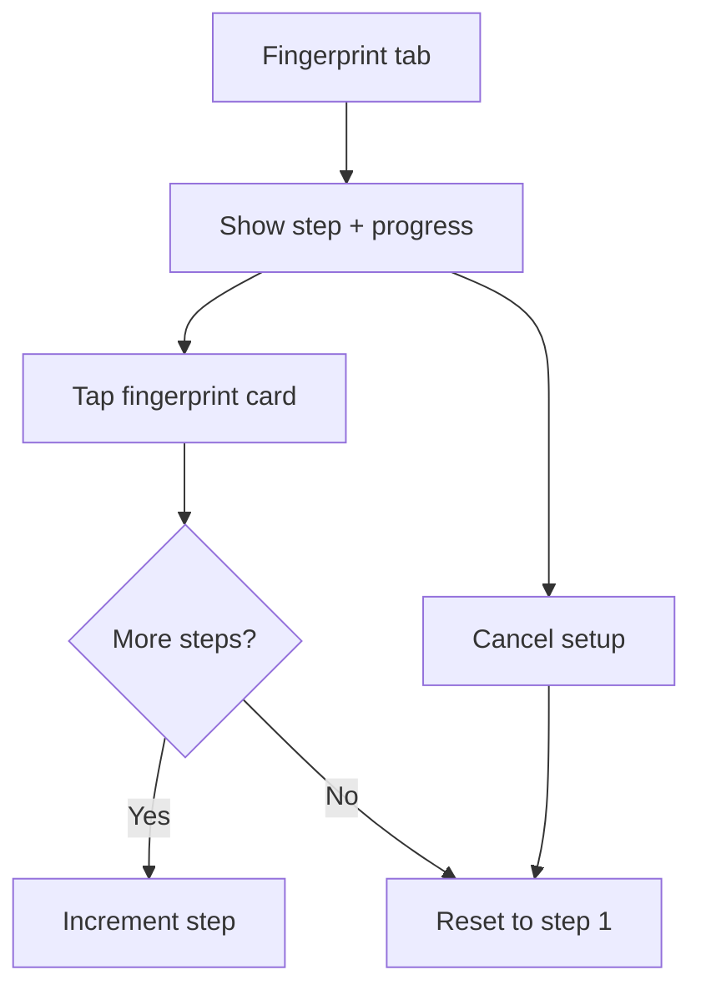
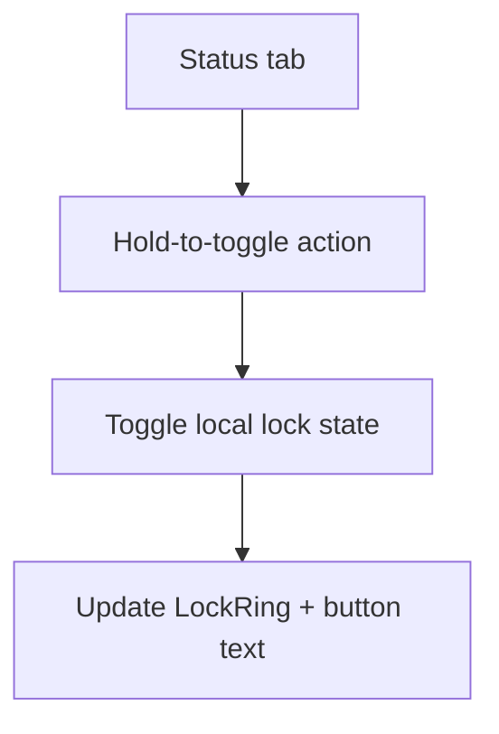

# Flowcharts

This document provides visual explanations of the core application flows.

## 1) App Bootstrap & Navigation

```mermaid
flowchart TD
  A[App start] --> B[WidgetsFlutterBinding.ensureInitialized]
  B --> C[Firebase.initializeApp]
  C --> D[runApp(MyApp)]
  D --> E[MultiProvider\nLocation + Geofence services]
  E --> F[HomeShell]
  F --> G[Bottom navigation]
  G --> H1[Status]
  G --> H2[Fingerprint]
  G --> H3[Location]
  G --> H4[Settings]
```

## 2) Live Location Update Flow

```mermaid
flowchart LR
  A[Realtime DB: latest_location] --> B[FirebaseLocationService listener]
  B --> C[Parse latitude/longitude\naltitude/accuracy/timestamp]
  C --> D[Update state + lastSeenText]
  D --> E[notifyListeners()]
  E --> F[LocationScreen Consumer]
  F --> G[Map marker + accuracy ring]
  F --> H[Location card + last fetch]
  F --> I[Snackbar when coordinates change]
```

## 3) Geofence Setup & Persistence



## 4) Breach Detection & Alerting

```mermaid
flowchart TD
  A[GeofenceService receives updates] --> B[Compute distance (Haversine)]
  B --> C{Inside radius?}
  C -- Yes --> D[isInsideGeofence = true]
  C -- No --> E[hasBreached = true]
  E --> F[HomeShell listener]
  F --> G[Haptic alert + modal dialog]
  G --> H[Dismiss or View Location]
  H --> I[clearBreach()]
```

## 5) Fingerprint Enrollment (UI)



## 6) Status Lock Toggle (UI)


